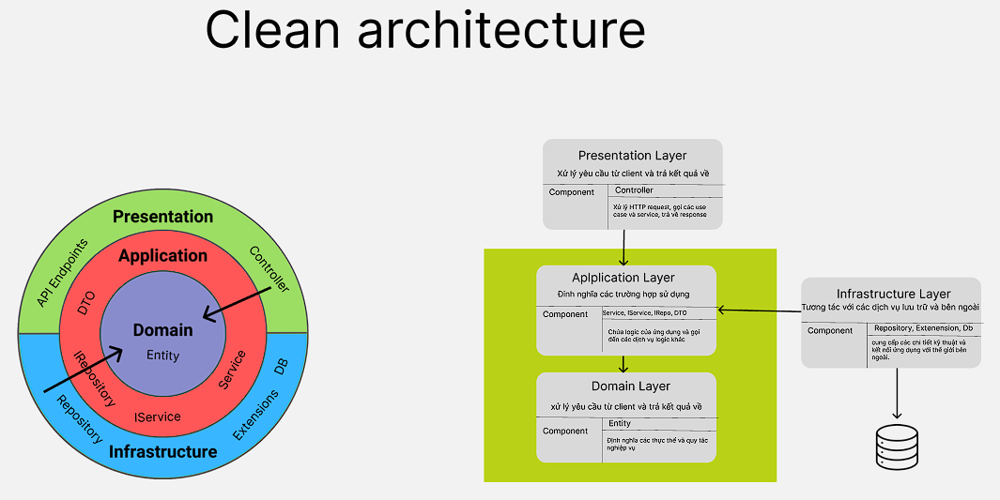
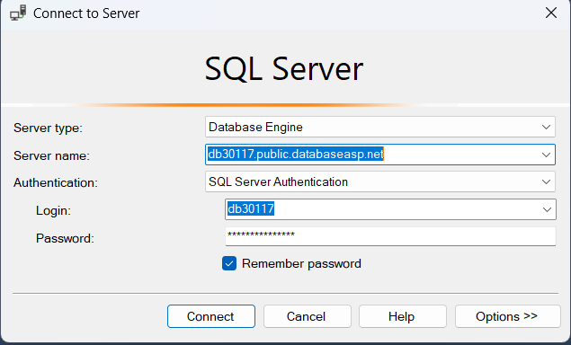

Dự án về thu mua xe điện và pin đã qua sử dụng 

Kiến trúc sử dụng : Clean Architecture (https://www.figma.com/design/e4BolXdurqtFAOxwP8i3nI/Untitled?node-id=0-1&p=f&t=cmgjbntHRdr0AAwT-0)

Hỉnh ảnh kiến trúc : 

Dự án bao gồm 3 luồng chính :

+ Đăng tin, mua gói đăng và thanh toán 

+ Messenger (real-time)

+ Báo cáo doanh thu thống kê, xuất ra file báo cáo

Có 2 Actor chính là User và Admin :

+ User : đăng ký or (goolge), đăng nhập or (google), tạo tin, lưu nháp, quản lí tin đăng, đăng tin, ẩn tin, mua gói đăng, xem tin user khác, bình luận tin, chat trực tiếp vơi người đăng 
  -Tài khoản test( nếu không muốn đăng ký) : 
    + Số điện thoại : 099999999
    + Mật khẩu : Customer01

+ Admin : Dashboard, báo cáo chi tiết doanh thu, xuất ra file doanh thu, quản lý gói, quản lí item
  -Tài khoản test :
    + Số điện thoại : 12345678910
    + Mật khẩu : admin

Deploy :
 + Backend : http://vehiclemarket.runasp.net/swagger/index.html
 + Fontend : https://animated-manatee-c382b1.netlify.app (deploy đã hết sử dụng được do hết hạn)

Database :
 _ Sử dụng Database Server hãy nhập (có ảnh mô tả) : 
   + Serve rName : db30117.public.databaseasp.net
   + Login : db30117
   + Password : code2lazy 
   + Trust Server Certificate : tick ( nếu không tick thì sẽ không chạy được)
   
_ Nếu không muốn sử dụng Database Server thì sử dụng import file bacpac : db30117.bacpac

_ Còn nếu không sử dụng các cách trên thì import sql này (nhưng sẽ không có sẵn các data)  : vehiclemarket.sql

Hướng dẫn sử dụng :
_ File Backend : BE_2hand_Battery_Trading_Platform
  
 + Mở bằng Visual Stutio (tím), có thể chạy luôn vì database và backend đã deploy lên server monsterasp

 + Để Deploy lên server vào phần Build ấn publish [tên project], nó sẽ deploy Be bên link:  http://vehiclemarket.runasp.net/swagger/index.html

_ File Fontend : FE_2hand_Battery_Trading_Platform-feature-admin-dashboard
 + Mở bằng  Visual Stutio Code, chạy lên terminal "npm i" sau đó chạy "npm run dev" 

 + Lưu ý rằng font-end đang lấy link của backend ở trên server

